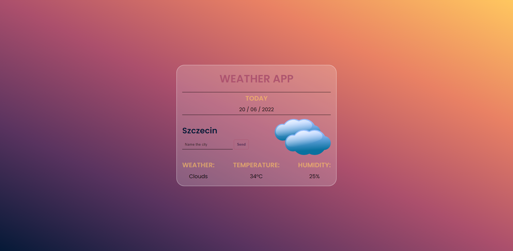

# Weather App

## Welcome! 👋

Thank you for looking here again :)

In my next project, I focused on JS performance where I wanted to create a Weather App.
I using [this API](https://openweathermap.org/current#geocoding).

> Live project: https://xbuzax.github.io/WeatherApp/
